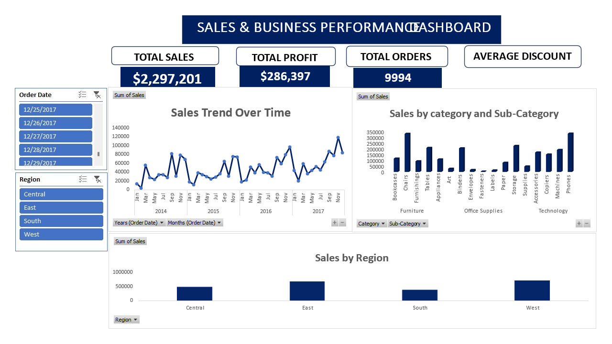

# excel-sales-dashboard
Excel-Sales-Dashboard
#Sales and Business Performance Dashboard(Excel)
This project is an interactive sales dashboard built in Excel using PivotTables, slicers, and charts to provide insights into business performance
## Project Overview
- Used sales dataset from [Superstore/Retail domain]
- Created dynamic PivotTables to calculate key metrics
- Built slicers for time and region filtering
- Designed a clean dashboard showing:
- Total Sales
- Total Profit
- Quantity Given
- Regional Performance Charts
- Monthly Treands
  ## Features
  -Interactive filtering with slicers (Region,Year)
  -KPI cards for key business metrics
  -Charts:clustered bar, line chart,column chart
  -Excel functions and PivotTable formatting
  ## Tools Used
  -Microsoft Excel(PivotTables,Slicers, Charts)
  ## File Structure
  -'Excel_Sales_Dashboard.xlsx'
  -Sheet 1: Raw Data
  -Sheet 2: Pivot Tables
  -Sheet 3: Dashboard
  ### Preview
  
  ---
  **Note:** This dashboard is suitable for business users who want quick insights from raw data using Excel's native tools.
  
  
